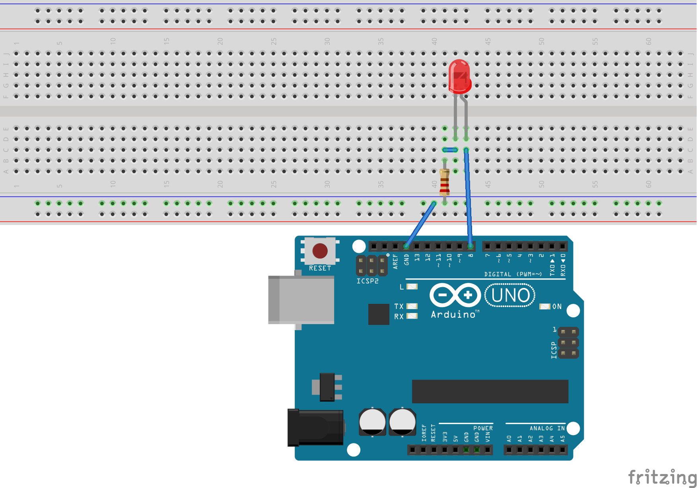

# Blink a Led   

This example demonstrates the library usage in a simple blink a Led example. 
It also shows how to use the Pin and Led abstraction objects. 

The pinout of the **ATmega48P/88P/168P/328P AVR microcontrollers** family is illustrated bellow:

{ width="250" }

## Hardware

* Arduino UNO
* generic Led
* 220 ohm current limiting resistor
* A breadboard

The Led with the current limiting resistor are connected to pin PB0 (digital pin 8 in Arduino UNO).

## Circuit

The circuit connection is as follows:


## Code

The following code blinks the Led with a delay of 500 ms:

```
#include "Led.h"
#include <util/delay.h>

#define PIN_NUMBER 0  /**< Led pin number */
#define TIMEDELAY 500 /**< Time delay */

int main(void) {

  // Init

  // Instantiate a Led object
  component::Led Led(io::Pin(PIN_NUMBER,io::PortB));

  // Mainloop
  while (1) {

      Led.on();
      _delay_ms(TIMEDELAY);

      Led.off();
      _delay_ms(TIMEDELAY);
  }
  return 0;
}
```

## Author

* Farid Oubbati
* Date: 12-May-2018
* Copyright (c) 2018

## License

This project is licensed under the MIT License - see the [LICENSE.txt](LICENSE.txt) file for more details
