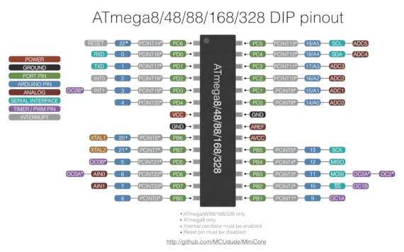
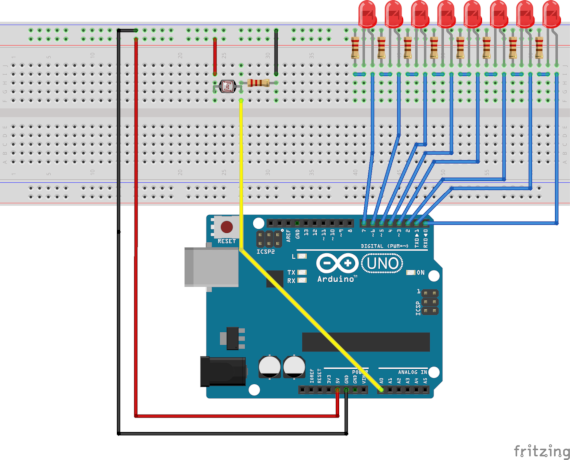

# Light Meter {#a4}

This example presents an AVR based Light Meter that displays its Lux measurements in a Led bank
It also demonstrates the use of the LED, LDR and ADC abstraction objects.
 
 
The pinout of the **ATmega48P/88P/168P/328P AVR microcontrollers** family is illustrated bellow:



## Hardware

* Arduino UNO
* Light Dependant Resistor (LDR)
* 5 kOhm resistor or a Potentiometer
* A breadboard

## Circuit

The LDR is a passive component. To measure its resistance change we have to send a current in the component between two potentials. We have to create a voltage divider bridge using the LDR and the 5 kOhm resistor. The voltage divider output is
read by the AVR Analog-to-Digial-Converter via pin PC0 (A0 pin in Arduino UNO). The light Lux measurements are displayed in a 
Led bank.


The circuit connection is as follows:




## Code

The following code permits to run the AVR based Light Meter that displays its Lux measurements in a Led bank:


```
#include "Led.h"
#include "ADC.h"
#include "LDR.h"

#define LED0 0 /**< Led 0 */
#define LED1 1 /**< Led 1 */
#define LED2 2 /**< Led 2 */
#define LED3 3 /**< Led 3 */
#define LED4 4 /**< Led 4 */
#define LED5 5 /**< Led 5 */
#define LED6 6 /**< Led 6 */
#define LED7 7 /**< Led 7 */

#define LDRVD 0 /**< LDR */


int main(void) {

  // Init

  // Instantiate Led objects
  component::Led Led[8]={
        {io::Pin(LED0,io::PortD)},
        {io::Pin(LED1,io::PortD)},
        {io::Pin(LED2,io::PortD)},
        {io::Pin(LED3,io::PortD)},
        {io::Pin(LED4,io::PortD)},
        {io::Pin(LED5,io::PortD)},
        {io::Pin(LED6,io::PortD)},
        {io::Pin(LED7,io::PortD)}};


  // Instantiate ADC object
  core::ADConverter &myADC = core::ADConverter::getInstance();

  // Start conversion
  myADC.start();

  // Instantiate LDR object
  component::LDR LDR(io::Pin(LDRVD,io::PortC),myADC);


  // Mainloop
  while (1) {


    for (uint8_t i=0;i<=(7-(LDR.getLux(5) & 7));i++)
    {
        Led[i].on();
    }

    for (uint8_t i=(7-(LDR.getLux(5) & 7))+1;i<8;i++)
    {
        Led[i].off();
    }

  }
  return 0;
}

```

## Author

* Farid Oubbati
* Date: 12-May-2018
* Copyright (c) 2018

## License

This project is licensed under the MIT License - see the [LICENSE.txt](LICENSE.txt) file for more details
