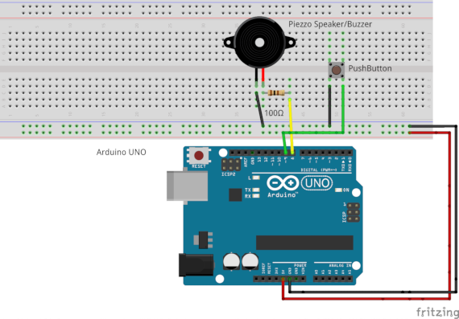

# AVR Music Box {#a3}

This example allows the user to play a predefined song in a Buzzer and control its tempo via a PushButton
It also demonstrates the use of the Buzzer and PushButton abstraction objects.
 
 
The pinout of the **ATmega48P/88P/168P/328P AVR microcontrollers** family is illustrated bellow:


## Hardware

* Arduino UNO
* Piezo speaker/Buzzer
* 100 ohm current limiting resistor
* Switch/PushButton
* A breadboard

The Buzzer with the current limiting resistor are connected to pin PB0 (digital pin 8 in Arduino UNO) and the PushButton is connected to PB1 (digital pin 9 in Arduino UNO).

## Circuit

The circuit connection is as follows:




## Code

The following code permits to turn a Buzzer into a Music Box that plays a predefined song which tempo is controlled by a PushButton:


```
#include "Buzzer.h"
#include "PushButton.h"
// Note pitch data
#include "buzzer_pitches_16bit.h"


#define BUZZER 0 /**< Buzzer pin number */

#define PUSHBUTTON 1 /**< PushButton pin number */

#define SONG_LENGTH (sizeof(l_song) / sizeof(uint16_t)) /**< Song length */

int main(void) {

  // Init

  // Instantiate a Buzzer object
  component::Buzzer Buzzer(io::Pin(BUZZER,io::PortB));

  // Instantiate a PushButton object
  component::PushButton PushButton(io::Pin(PUSHBUTTON,io::PortB));

  // Song notes
  const uint16_t l_song[] = {
  E6, E6, E6, C6, E6, G6, G5,
  C6, G5, E5, A5, B5, Ax5, A5,
  G5, E6, G6, A6, F6, G6, E6, C6, D6, B5,
  C6, G5, E5, A5, B5, Ax5, A5,
  G5, E6, G6, A6, F6, G6, E6, C6, D6, B5,
  };

  // Start song at start
  uint8_t l_note = SONG_LENGTH - 1;

  // Initialize PushButton state
  uint8_t l_statePushButton = 0;


  // Mainloop
  while (1) {
      // Check if PusgButton is pressed
      if (PushButton.isPressed())
      {
          // Check if a new button press
          if (!l_statePushButton) {
              // play next note
              l_note++;
              // start from start
              if (l_note == SONG_LENGTH) {

                  l_note = 0;

              }

              l_statePushButton = 1;

          }
          // Play note
          Buzzer.buzz(l_song[l_note], 1600);

      } else {

          l_statePushButton=0;

      }

  }
  return 0;
}
```

## Author

* Farid Oubbati
* Date: 12-May-2018
* Copyright (c) 2018

## License

This project is licensed under the MIT License - see the [LICENSE.txt](LICENSE.txt) file for more details
