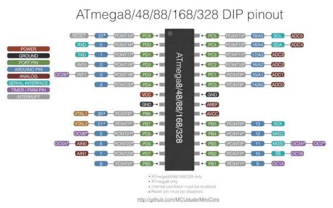
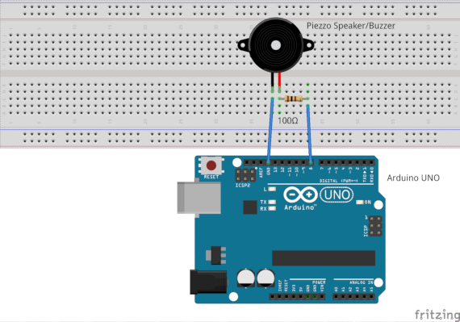

# AVR Square-Wave Organ {#a2}

This example enables the user to enter a key note via a serial terminal and play the corresponding note in a Buzzer. It also shows how to use the Buzzer and USART0 abstraction objects.


The pinout of the **ATmega48P/88P/168P/328P AVR microcontrollers** family is illustrated bellow:



## Hardware

* Arduino UNO
* Piezo speaker/Buzzer
* 100 ohm current limiting resistor
* A breadboard

The Buzzer with the current limiting resistor are connected to pin PB0 (digital pin 8 in Arduino UNO).

## Circuit

The circuit connection is as follows:




## Code

The following code permits to turn a Buzzer to an Organ that plays notes entered by a user via a serial terminal (GTKTerm serial port terminal is used):

```
#include "Buzzer.h"
#include "USART0.h"
#include "buzzer_pitches_16bit.h"


#define BUZZER 0 /**< Buzzer pin number */

#define NOTE_DURATION  0xF000 /**< Note duration */

int main(void) {

  // Init

  // Instantiate a Buzzer object
  component::Buzzer Buzzer(io::Pin(BUZZER,io::PortB));

  // Instantiate a USART0 object
  io::USART0 &myUSART0 = io::USART0::getInstance();

  // List of possible keypresses
  const uint8_t l_keys[] = { 'a', 'w', 's', 'e', 'd', 'f', 't',
      'g', 'y', 'h', 'j', 'i', 'k', 'o',
      'l', 'p', ';', '\''
  };

  // List of the keypresses corresponding pitches
  const uint16_t l_notes[] = { G4, Gx4, A4, Ax4, B4, C5, Cx5,
      D5, Dx5, E5, F5, Fx5, G5, Gx5,
      A5, Ax5, B5, C6
  };

  // Character key from computer serial terminal
  unsigned char l_key;

  // Current note length
  uint16_t l_currentNoteLength = NOTE_DURATION;

  // Check if note key
  uint8_t l_isNote;

  myUSART0.sendString("----- Serial Organ ------\r\n");

  // Mainloop
  while (1) {

      // Send N to signal that AVR chip is ready for next key note input
      myUSART0.sendString("Enter key note\r\n");

      // Wait for key note input
      while (myUSART0.getNumberBytesReceived()==0)
      {
              myUSART0.receiveChar(l_key);

      }
      myUSART0.resetNumberBytesReceived();

      /********** Play key notes ***********/

      l_isNote = 0;
      // loop through keys table
      for (uint8_t i = 0; i < sizeof(l_keys); i++) {
          // found match in lookup table
          if (l_key == l_keys[i]) {
              Buzzer.buzz(l_notes[i], l_currentNoteLength);
              // record that we've found a note
              l_isNote = 1;
              break;
          }
      }

      // Handle non-note keys: tempo changes and rests
      if (!l_isNote) {
          if (l_key == '-') {
              // code for short note
              l_currentNoteLength = l_currentNoteLength / 2;
          }
          else if (l_key == '+') {
              // code for long note
              l_currentNoteLength = l_currentNoteLength * 2;
          }
          else {
              // unrecognized, just rest
              Buzzer.pause(l_currentNoteLength);
          }
      }

  }
  return 0;
}

```

## Author

* Farid Oubbati
* Date: 12-May-2018
* Copyright (c) 2018

## License

This project is licensed under the MIT License - see the [LICENSE.txt](LICENSE.txt) file for more details
